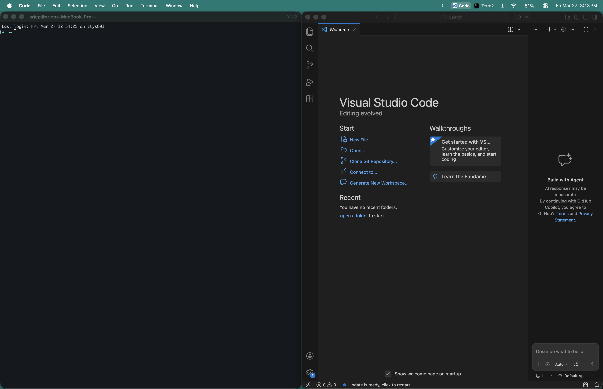

# AeroTabs

A native macOS menu bar app that shows your current [AeroSpace](https://github.com/nikitabobko/AeroSpace) workspace windows as clickable tabs with app icons.



## Features

- Shows each window on the focused AeroSpace workspace as a tab in the menu bar
- Click a tab to focus that window
- Active window highlighted with a pill background
- Three display modes: **Icon + Name (All)**, **Icon + Name (Active Only)**, **Icon Only**
- Right-click for settings (display mode, launch at login, quit)
- Event-driven updates — no polling, instant response
- Single menu bar item — works with [Hidden Bar](https://github.com/dwarvesf/hidden) and other menu bar managers
- Lightweight native Swift app — no Electron, no runtime dependencies

## How It Works

```
                                AeroSpace
                                   |
                      focus/workspace change event
                                   |
                                   v
                     aerospace config (full.toml)
                                   |
                   exec-and-forget: open -a AeroTabs
                                   |
                                   v
                            AeroTabs.app
                                   |
                    +------+-------+-------+
                    |              |              |
                    v              v              v
           aerospace          aerospace       aerospace
         list-windows       list-windows     focus --window-id
       --workspace focused    --focused        (on tab click)
                    |              |
                    v              v
              window list     focused ID
                    |              |
                    +------+-------+
                           |
                           v
                    NSStatusItem with
                    TabStripView renders
                    icons + labels + pill
```

## Install

### Homebrew (recommended)

```bash
brew tap alexlazarian/aerotabs
brew install --cask aerotabs
```

### Build from source

Requires Xcode Command Line Tools or Xcode.

```bash
git clone https://github.com/alexlazarian/aerotabs.git
cd aerotabs
make install
```

This builds a release binary and installs `AeroTabs.app` to `/Applications/`.

To uninstall:

```bash
make uninstall
```

## AeroSpace Configuration

Add these lines to your `~/.aerospace.toml` to trigger AeroTabs on focus and workspace changes:

```toml
on-focus-changed = ['exec-and-forget /usr/bin/open -a AeroTabs --args --refresh']
exec-on-workspace-change = ['/usr/bin/open', '-a', 'AeroTabs', '--args', '--refresh']
```

Then reload your config:

```bash
aerospace reload-config
```

## Display Modes

Right-click any tab to switch between modes:

| Mode | Active Tab | Inactive Tabs |
|------|-----------|---------------|
| **Icon + Name (All)** | Icon + name + pill | Icon + name |
| **Icon + Name (Active Only)** | Icon + name + pill | Icon only |
| **Icon Only** | Icon + pill | Icon only |

Default is **Icon + Name (All)**.

## Requirements

- macOS 14+ (Sonoma or later)
- [AeroSpace](https://github.com/nikitabobko/AeroSpace) window manager

## License

MIT
