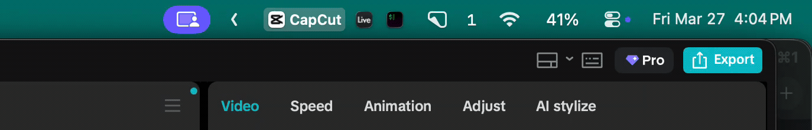

<p align="center">
  
  <br>
  <strong>AeroTabs</strong>
</p>

<p align="center">
  A companion app for <a href="https://github.com/nikitabobko/AeroSpace">AeroSpace</a> window manager that shows your workspace windows as clickable tabs in the macOS menu bar.
</p>

<p align="center">
  
</p>

> **Requires [AeroSpace](https://github.com/nikitabobko/AeroSpace).** AeroTabs is built specifically for AeroSpace and will not work without it.

## Features

- Shows each window on your focused workspace as a tab with its app icon
- Click a tab to focus that window
- Active window highlighted with a pill background
- Three display modes: **Icon + Name (All)**, **Icon + Name (Active Only)**, **Icon Only**
- Right-click for settings (display mode, launch at login, quit)
- Event-driven updates via AeroSpace hooks — no polling, instant response
- Lightweight native Swift app — no Electron, no runtime dependencies

## Install

### Homebrew (recommended)

```bash
brew tap alexlazarian/aerotabs
brew install --cask aerotabs
```

### Build from source

Requires Xcode Command Line Tools or Xcode.

```bash
git clone https://github.com/alexlazarian/aerotabs.git
cd aerotabs
make install
```

This builds a release binary and installs `AeroTabs.app` to `/Applications/`.

To uninstall:

```bash
make uninstall
```

## Setup

Add these lines to your `~/.aerospace.toml` to trigger AeroTabs on focus and workspace changes:

```toml
on-focus-changed = ['exec-and-forget /usr/bin/open -g -a AeroTabs --args --refresh']
exec-on-workspace-change = ['/usr/bin/open', '-g', '-a', 'AeroTabs', '--args', '--refresh']
```

Then reload your config:

```bash
aerospace reload-config
```

## Display Modes

Right-click any tab to switch between modes:

| Mode | Active Tab | Inactive Tabs |
|------|-----------|---------------|
| **Icon + Name (All)** | Icon + name + pill | Icon + name |
| **Icon + Name (Active Only)** | Icon + name + pill | Icon only |
| **Icon Only** | Icon + pill | Icon only |

Default is **Icon + Name (All)**.

## How It Works

AeroTabs listens for focus and workspace change events from AeroSpace, queries the current workspace windows via the `aerospace` CLI, and renders them as a single `NSStatusItem` in the menu bar.

```
    AeroSpace focus/workspace change
                  |
                  v
       aerospace config hook
     (exec-and-forget: open -g)
                  |
                  v
           AeroTabs.app
                  |
        +---------+---------+
        |                   |
        v                   v
  aerospace             aerospace
  list-windows          list-windows
  --workspace focused   --focused
        |                   |
        v                   v
  window list          focused ID
        |                   |
        +---------+---------+
                  |
                  v
          NSStatusItem
       renders app icons,
       labels, active pill
```

## Requirements

- macOS 14+ (Sonoma or later)
- [AeroSpace](https://github.com/nikitabobko/AeroSpace) window manager

## License

MIT
